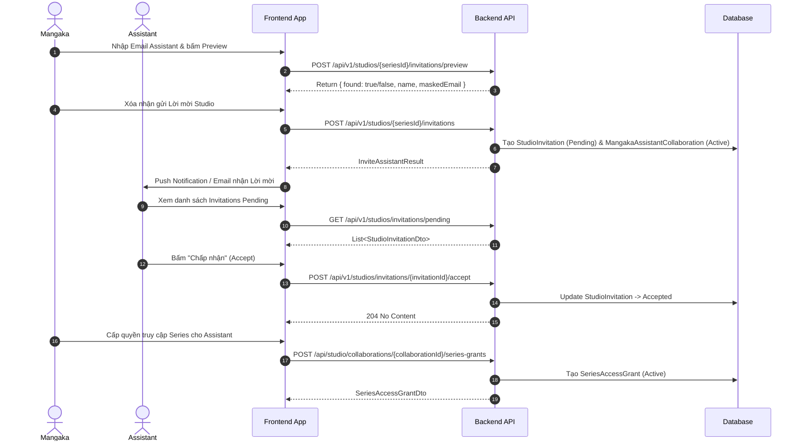

# Frontend - Backend Integration Contract: Assistant Collaboration, PageTask & Task Assignment Workflow

> **Trạng thái tài liệu:** Canonical Hand-off Document  
> **Nguồn đối chiếu:** Codebase Monolith Runtime (`MangaERP.Task`, `MangaERP.Studio`, `MangaERP.Chapter`, `MangaERP.Publishing`, `MangaERP.Identity`, `MangaERP.Api`)  
> **Đối tượng áp dụng:** Frontend Team (React / Web App)

---

## IX. Final Confirmation & Compliance Check

| Tiêu chí | Trạng thái | Ghi chú |
|---|:---:|---|
| **Canonical API Inventory Complete** | **YES** | 100% Controllers đã được rà soát từ C# attributes. |
| **Previously Existing Logic Included** | **YES** | Đã bao gồm toàn bộ rule về Workload, SeriesAccess, Collaboration, Standby Backup, Halfway Warning. |
| **FE-Unread / Forgotten Logic Identified** | **YES** | Lập danh sách 25+ điểm FE có nguy cơ bỏ sót cao. |
| **All PageTask States Documented** | **YES** | 8/8 states từ `PageTaskStatus` enum. |
| **All AssignmentAttempt States Documented** | **YES** | 6/6 states từ `TaskAssignmentAttemptStatus` enum. |
| **All Errors FE Must Handle Documented** | **YES** | Ma trận 400, 403, 404, 409 (Business Message). |
| **All Notifications Documented** | **YES** | Chi tiết Type, Recipient, Trigger, Refreshes. |
| **Legacy APIs Mapped to Replacements** | **YES** | Danh sách route alias, chapter recommend cũ, direct activate. |
| **Frontend Gap Checklist Produced** | **YES** | Phân loại Must / Should / Can Defer. |
| **Ready to Hand Off to FE** | **YES** | Đầy đủ DTO, JSON Shape, Route, Code Examples & Rules. |
| **Files Changed (Code)** | **NONE** | Không chỉnh sửa source code dự án. |
| **Database Changed** | **NO** | Không thay đổi schema / data. |
| **Commit / Push Executed** | **NO** | Không thực hiện commit hay push git. |

---

## I. Tổng quan Phạm vi Architecture & Business Rules

Hệ thống quản lý công việc Assistant (Assistant Collaboration, PageTask, Assignment) được thiết kế theo các nguyên tắc cốt lõi sau:

1. **Collaboration & Series Access:**
   - Để một Assistant có thể nhận task trong một Series, Assistant đó phải có **MangakaAssistantCollaboration** ở trạng thái `Active` VÀ phải được cấp **SeriesAccessGrant** cho Series cụ thể đó.
   - Nếu chưa được cấp SeriesAccess, Assistant vẫn có thể xuất hiện trong danh sách candidate nhưng ở danh sách `UnavailableAssistants` với mã lý do `SeriesAccessMissing`.

2. **Assignment Lifecycle & Dual-Role (Primary & Backup):**
   - Một lượt giao task tạo ra `TaskAssignmentAttempt` ở trạng thái `PendingAcceptance`.
   - **Primary Assistant:** Phải thực hiện `Accept` trước khi task thực sự bắt đầu (`WorkStartedAt` được ghi nhận, task chuyển sang `Incomplete/InProgress`). Nếu Primary `Reject`, task lập tức chuyển sang `ReassignmentRequired`.
   - **Backup Assistant:** Khi nhận lời mời Standby, Backup `Accept` chỉ đóng vai trò xác nhận sẵn sàng (Standby). Task **KHÔNG** tự động Promote Backup thành Primary khi Primary reject.
   - **Takeover:** Mangaka phải chủ động kích hoạt `Takeover`. Khi Takeover được gọi, nỗ lực cũ của Primary bị `Superseded`, Backup được chuyển thành Primary executor (`AssignedAssistantId` được gán bằng `BackupAssistantId`), `WorkStartedAt` được reset về thời điểm Takeover, và Primary cũ mất hoàn toàn quyền xem file / nộp bài.

3. **Cancel-and-Recreate:**
   - Đây **không phải** là hành động Reassign. Hành động này soft-delete task cũ (`IsDeleted = true`, status = `Cancelled`), giữ nguyên `PageNumber`, và tạo ra một `PageTask` mới nguyên bản ở trạng thái `Pending` (chưa phân công).
   - Backend trả về `newPageTaskId`. FE **bắt buộc** phải chuyển hướng URL / cập nhật state sang `newPageTaskId` này và xóa cache của task cũ.

---

## II. Canonical API Inventory (Danh mục API Thực tế)

### Phân loại Trạng thái API cho Frontend:
- **`[FE-Likely]`**: FE hiện đã hoặc đang tích hợp.
- **`[FE-MustAdd]`**: API bắt buộc FE phải tích hợp mới để hoàn thiện workflow.
- **`[FE-StopUsing]`**: API legacy / cũ FE cần ngừng sử dụng.
- **`[Internal/BG]`**: API chạy background hoặc internal system.
- **`[LegacyAlias]`**: Route phụ giữ lại để backward compatibility, khuyến cáo dùng Canonical Route.

| Module | Method | Exact Route (Canonical) | Controller Action | Request DTO | Response DTO | Allowed Roles | Ownership / Scope Rule | FE Classification |
|---|---|---|---|---|---|---|---|---|
| **Studio** | `POST` | `/api/v1/studios/{seriesId}/invitations/preview` | `StudioInvitationPreviewController.Preview` | `PreviewRequest` | `object { found, personalEmail, name, maskedInternalEmail }` | `Mangaka` | Phải là tác giả Series | `[FE-MustAdd]` |
| **Studio** | `POST` | `/api/v1/studios/{seriesId}/invitations` | `StudioInvitationsController.InviteAssistant` | `InviteAssistantRequest` | `InviteAssistantResult` | `Mangaka` | Owner Series | `[FE-Likely]` |
| **Studio** | `GET` | `/api/v1/studios/{seriesId}/invitations` | `StudioInvitationsController.GetSeriesInvitations` | *None* | `IEnumerable<StudioInvitationDto>` | `Mangaka` | Owner Series | `[FE-Likely]` |
| **Studio** | `GET` | `/api/v1/studios/{seriesId}/members` | `StudioInvitationsController.GetStudioMembers` | *None* | `IEnumerable<StudioMemberDto>` | `Mangaka` | Owner Series | `[FE-Likely]` |
| **Studio** | `POST` | `/api/v1/studios/invitations/{invitationId}/cancel` | `StudioInvitationsController.CancelInvitation` | *None* | `204 NoContent` | `Mangaka` | Người tạo invitation | `[FE-Likely]` |
| **Studio** | `POST` | `/api/v1/studios/invitations/{invitationId}/retry-registration` | `StudioInvitationsController.RetryRegistrationDelivery` | *None* | `RetryRegistrationDeliveryResult` | `Mangaka` | Người tạo invitation | `[FE-MustAdd]` |
| **Studio** | `GET` | `/api/v1/studios/invitations/pending` | `StudioInvitationsController.GetPendingInvitations` | *None* | `IEnumerable<StudioInvitationDto>` | `Assistant` | Lời mời gửi tới Assistant | `[FE-Likely]` |
| **Studio** | `POST` | `/api/v1/studios/invitations/{invitationId}/accept` | `StudioInvitationsController.AcceptInvitation` | *None* | `204 NoContent` | `Assistant` | Assistant được mời | `[FE-Likely]` |
| **Studio** | `POST` | `/api/v1/studios/invitations/{invitationId}/decline` | `StudioInvitationsController.DeclineInvitation` | *None* | `204 NoContent` | `Assistant` | Assistant được mời | `[FE-Likely]` |
| **Studio** | `POST` | `/api/v1/studios/collaborations/{collaborationId}/suspend` | `StudioInvitationsController.SuspendCollaboration` | `CollaborationStateRequest` | `204 NoContent` | `Mangaka, Admin` | Owner Mangaka của Collab | `[FE-MustAdd]` |
| **Studio** | `POST` | `/api/v1/studios/collaborations/{collaborationId}/suspension-mode` | `StudioInvitationsController.ChangeSuspensionMode` | `CollaborationStateRequest` | `204 NoContent` | `Mangaka, Admin` | Owner Mangaka | `[FE-MustAdd]` |
| **Studio** | `POST` | `/api/v1/studios/collaborations/{collaborationId}/reactivate` | `StudioInvitationsController.ReactivateCollaboration` | `ReactivateCollaborationRequest` | `204 NoContent` | `Mangaka, Admin` | Owner Mangaka | `[FE-MustAdd]` |
| **Studio** | `POST` | `/api/studio/collaborations/{collaborationId}/series-grants` | `SeriesAccessController.GrantSeriesAccess` | `GrantSeriesAccessRequest` | `SeriesAccessGrantDto` | `Authorize` | Owner Mangaka của Collab | `[FE-MustAdd]` |
| **Studio** | `DELETE` | `/api/studio/collaborations/{collaborationId}/series-grants/{seriesId}` | `SeriesAccessController.RevokeSeriesAccess` | `RevokeSeriesAccessRequest` | `204 NoContent` | `Authorize` | Owner Mangaka của Collab | `[FE-MustAdd]` |
| **Studio** | `GET` | `/api/studio/collaborations/{collaborationId}/series-grants` | `SeriesAccessController.GetCollaborationSeriesGrants` | *None* | `IEnumerable<SeriesAccessGrantDto>` | `Authorize` | Owner / Assistant của Collab | `[FE-MustAdd]` |
| **Studio** | `DELETE` | `/api/v1/studios/{seriesId}/members/{assistantId}` | `StudiosController.RemoveMember` | *None* | `204 NoContent` | `Mangaka` | Owner Series | `[FE-Likely]` |
| **Chapter** | `GET` | `/api/v1/studios/{seriesId}/tasks/board` | `StudiosController.GetTasksBoard` | *None* | `StudioTasksBoardDto` | `Mangaka, TantouEditor, Assistant` | Phải thuộc Series / Collab | `[FE-Likely]` |
| **Chapter** | `POST` | `/api/v1/chapters/{chapterId}/pages/activate` | `ChaptersController.ActivatePageTask` | `ActivatePageTaskRequest` | `ActivatePageTaskResult` | `Mangaka` | Owner Series | `[FE-Likely]` |
| **Chapter** | `POST` | `/api/v1/chapters/{chapterId}/pages/bulk-activate` | `ChaptersController.BulkActivatePageTasks` | `BulkActivatePageTasksRequest` | `BulkActivatePageTasksResult` | `Mangaka` | Owner Series | `[FE-Likely]` |
| **Chapter** | `GET` | `/api/v1/chapters/{chapterId}/recommend-assistants` | `ChaptersController.RecommendAssistants` | *None* | `IEnumerable<RecommendedAssistantDto>` | `Mangaka` | Owner Series | `[FE-StopUsing]` |
| **Chapter** | `GET` | `/api/v1/chapters/{chapterId}/assistant-candidates` | `ChaptersController.GetChapterAssistantCandidates` | *None* | `ChapterAssistantCandidatesResultDto` | `Mangaka` | Owner Series | `[FE-MustAdd]` |
| **Chapter** | `PUT` | `/api/v1/chapters/{chapterId}/pages/{pageNumber}/reassign` | `ChaptersController.ReassignPageTask` | `ReassignPageTaskRequest` | `ReassignPageTaskResult` | `Mangaka` | Owner Series | `[FE-StopUsing]` |
| **Task** | `GET` | `/api/v1/tasks/{taskId}/assistant-candidates` | `TaskAssignmentsController.GetAssistantCandidates` | *None* | `TaskAssistantCandidatesResultDto` | `Mangaka` | Owner Series | `[FE-MustAdd]` |
| **Task** | `POST` | `/api/v1/tasks/{taskId}/assignments` | `TaskAssignmentsController.AssignTask` | `AssignTaskRequest` | `AssignTaskResultDto` | `Mangaka` | Owner Series | `[FE-MustAdd]` |
| **Task** | `POST` | `/api/v1/tasks/assignments/{attemptId}/respond` | `TaskAssignmentsController.RespondTaskAssignment` | `RespondTaskAssignmentRequest` | `TaskAssignmentAttemptDto` | `Assistant` | Phải là Assistant được giao | `[FE-MustAdd]` |
| **Task** | `POST` | `/api/v1/tasks/assignments/{attemptId}/cancel` | `TaskAssignmentsController.CancelAssignment` | `CancelAssignmentRequest` | `object { success: true }` | `Mangaka` | Owner Series | `[FE-MustAdd]` |
| **Task** | `POST` | `/api/v1/tasks/{taskId}/reassign` | `TaskAssignmentsController.ReassignTask` | `ReassignTaskRequest` | `AssignTaskResultDto` | `Mangaka` | Owner Series | `[FE-MustAdd]` |
| **Task** | `POST` | `/api/v1/tasks/{taskId}/takeover` | `TaskAssignmentsController.RequestTakeover` | `RequestTakeoverRequest` | `RequestTakeoverResult` | `Mangaka` | Owner Series | `[FE-MustAdd]` |
| **Task** | `GET` | `/api/v1/tasks/{taskId}/assignment-history` | `TaskAssignmentsController.GetAssignmentHistory` | *None* | `TaskAssignmentHistoryResponseDto` | `Mangaka, Assistant, TantouEditor` | Có quyền xem Task | `[FE-MustAdd]` |
| **Task** | `GET` | `/api/v1/assistants/{assistantId}/workload` | `TaskAssignmentsController.GetAssistantWorkload` | *None* | `AssistantWorkloadDto` | `Mangaka, Assistant, TantouEditor` | Phải có liên kết làm việc | `[FE-MustAdd]` |
| **Task** | `POST` | `/api/v1/tasks/{taskId}/progress` | `TaskAssignmentsController.SubmitProgress` | `SubmitProgressRequest` | `TaskProgressDto` | `Assistant` | Primary Assistant hiện tại | `[FE-Likely]` |
| **Task** | `GET` | `/api/v1/tasks/{taskId}/progress` | `TaskAssignmentsController.GetProgressHistory` | *None* | `IEnumerable<TaskProgressDto>` | `Mangaka, Assistant, TantouEditor` | Có quyền xem Task | `[FE-Likely]` |
| **Task** | `GET` | `/api/v1/tasks/{taskId}/checkpoints` | `TaskAssignmentsController.GetCheckpoints` | *None* | `IEnumerable<TaskCheckpointDto>` | `Mangaka, Assistant, TantouEditor` | Có quyền xem Task | `[FE-MustAdd]` |
| **Task** | `POST` | `/api/v1/tasks/{taskId}/complete` | `TaskAssignmentsController.CompleteTask` | *None* | `TaskCompletionResultDto` | `Assistant` | Primary Assistant hiện tại | `[FE-Likely]` |
| **Task** | `POST` | `/api/v1/tasks/{pageTaskId}/cancel-and-recreate` | `TasksController.CancelAndRecreateTask` | `CancelAndRecreateTaskRequest` | `CancelAndRecreateTaskResult` | `Mangaka` | Owner Series | `[FE-MustAdd]` |
| **Task** | `POST` | `/api/v1/tasks/{pageTaskId}/layers` | `TasksController.SubmitLayer` | `SubmitArtworkLayerRequest` | `SubmitArtworkLayerResult` | `Assistant` | Primary Assistant hiện tại | `[FE-Likely]` |
| **Task** | `POST` | `/api/v1/tasks/{pageTaskId}/review` | `TasksController.ReviewLayer` | `ReviewLayerRequest` | `ReviewLayerResult` | `Mangaka` | Owner Series | `[FE-Likely]` |
| **Task** | `POST` | `/api/v1/tasks/bulk-review` | `TasksController.BulkReview` | `BulkReviewLayersRequest` | `BulkReviewLayersResult` | `Mangaka` | Owner Series | `[FE-Likely]` |
| **Task** | `GET` | `/api/tasks/{taskId}/files/{fileType}` | `TaskFilesController.StreamTaskFile` | *None* | File Stream (PNG) | `Authorize` | Authorize qua Policy Boundary | `[FE-Likely]` |

---

## III. FE Missing Awareness Inventory (Các logic/API FE có nguy cơ bỏ sót)

| Logic / API | Why FE may miss it | What screen/action needs it | What happens if FE ignores it | Priority |
|---|---|---|---|:---:|
| **Assistant Accept/Reject Requirement** | FE nghĩ gán xong là task chạy ngay. Thực tế task ở `PendingAcceptance`, `WorkStartedAt = null`. | Task Detail / Workspace của Assistant | Assistant không thấy nút Accept; Task đơ không tính deadline. | **Blocker** |
| **Backup Standby vs Promotion** | FE tưởng Backup sẽ tự nhảy lên làm task khi Primary Reject. Thực tế Backend giữ Backup ở Standby. | Mangaka Task Management UI | Mangaka không bấm Takeover hoặc Reassign, task bị nghẽn ở `ReassignmentRequired`. | **Blocker** |
| **Cancel-and-Recreate Redirect** | API trả về `newPageTaskId`. FE không biết và giữ nguyên `pageTaskId` cũ. | Task Detail (Mangaka) | UI gọi API tới Task đã soft-delete (`IsDeleted = true`) gây 404/Error. | **Blocker** |
| **Confirm Progress Loss (409)** | Khi Cancel-and-Recreate task có progress > 0, API trả 409 nếu thiếu `confirmProgressLoss: true`. | Cancel Task Dialog | Dialog đóng hoặc báo lỗi hệ thống generic thay vì hiện Confirm Popup. | **High** |
| **Artwork Submission Block Recreate** | Không được phép Cancel-and-Recreate nếu task đã có bài nộp artwork layer (trả HTTP 409). | Task Action Menu | Nút "Hủy & Tạo lại" vẫn clickable thay vì disabled / hidden. | **High** |
| **Series Access Grant Missing** | Assistant đã kết nối Collaboration nhưng chưa được cấp Series access sẽ bị loại khỏi danh sách gán. | Candidate Selection Modal | Mangaka không hiểu vì sao Assistant có trong Studio nhưng unavailable. | **High** |
| **Workload Capacity (Max = 3)** | Assistant chạm ngưỡng 3 tasks active (Pending + Accepted) sẽ bị báo `WorkloadLimitReached`. | Candidate Selection Modal | FE không render badge "Workload Full", gửi request bị backend từ chối 409. | **High** |
| **Takeover Actor Rule (403)** | Chỉ duy nhất Mangaka mới có quyền bấm Takeover. Backup Assistant không được tự Takeover. | Task Assignment Panel | Render nút Takeover ở màn hình Assistant gây lỗi 403 Forbidden. | **High** |
| **Deadline Halfway Warning** | Warning 50% thời hạn được tính từ `WorkStartedAt` (lúc Accept), không tính từ lúc Assign. | Notification Center & Progress Bar | Hiển thị mốc cảnh báo sai thời điểm. | **Medium** |
| **Preview Invitation Email Matching** | Mời qua email cá nhân sẽ tìm tài khoản `Assistant` đã tồn tại hoặc hỗ trợ luồng tạo mới. | Invite Assistant Modal | FE tự tạo account dummy ở Client thay vì dùng API preview. | **Medium** |

---

## IV. Detailed API Contracts (Các API Trọng yếu)

### 1. `GET /api/v1/tasks/{taskId}/assistant-candidates`
- **Purpose:** Lấy danh sách Assistant ứng viên cho một Task, phân nhóm rõ Available và Unavailable kèm mã lý do chi tiết và Workload hiện tại.
- **Allowed Actor:** `Mangaka` (Chủ sở hữu Series chứa Task).
- **Response JSON Structure:**
```json
{
  "taskId": "3fa85f64-5717-4562-b3fc-2c963f66afa6",
  "seriesId": "7ca85f64-5717-4562-b3fc-2c963f66afa6",
  "maxWorkload": 3,
  "availableAssistants": [
    {
      "assistantId": "11111111-1111-1111-1111-111111111111",
      "displayName": "Nguyen Van A",
      "email": "assistantA@manga.com",
      "activeTaskCount": 1,
      "pendingAssignmentCount": 0,
      "totalWorkload": 1,
      "maxWorkload": 3,
      "remainingCapacity": 2,
      "hasSeriesAccess": true,
      "isAvailable": true,
      "availabilityCode": "Available",
      "availabilityReason": null
    }
  ],
  "unavailableAssistants": [
    {
      "assistantId": "22222222-2222-2222-2222-222222222222",
      "displayName": "Tran Van B",
      "email": "assistantB@manga.com",
      "activeTaskCount": 3,
      "pendingAssignmentCount": 0,
      "totalWorkload": 3,
      "maxWorkload": 3,
      "remainingCapacity": 0,
      "hasSeriesAccess": true,
      "isAvailable": false,
      "availabilityCode": "WorkloadLimitReached",
      "availabilityReason": "Assistant has reached the maximum workload limit (3)."
    }
  ]
}
```
- **FE Integration Note:** 
  - `pendingAssignmentCount` is deprecated and always returns `0` under the Direct Assignment model. Frontend must not use this field.
  - FE **bắt buộc** render hai tab/danh sách. Phía danh sách `unavailableAssistants`, disable nút chọn và hiển thị Tooltip/Badge với nội dung `availabilityReason`. Không tự tính toán workload ở client.

---

### 2. `POST /api/v1/tasks/{taskId}/assignments`
- **Purpose:** Mangaka gửi lời mời phân công công việc tới Primary Assistant và tùy chọn Backup Assistant.
- **Allowed Actor:** `Mangaka`.
- **Request Body:**
```json
{
  "primaryAssistantId": "11111111-1111-1111-1111-111111111111",
  "backupAssistantId": "33333333-3333-3333-3333-333333333333",
  "description": "Vẽ hoàn thiện Line Art cho trang 5",
  "deadline": "2026-08-01T17:00:00Z",
  "responseDeadline": "2026-07-28T17:00:00Z"
}
```
- **Response JSON Structure:**
```json
{
  "taskId": "3fa85f64-5717-4562-b3fc-2c963f66afa6",
  "primaryAttempt": {
    "id": "99999999-9999-9999-9999-999999999999",
    "taskId": "3fa85f64-5717-4562-b3fc-2c963f66afa6",
    "assistantId": "11111111-1111-1111-1111-111111111111",
    "collaborationId": "88888888-8888-8888-8888-888888888888",
    "attemptNumber": 1,
    "status": "PendingAcceptance",
    "assignmentRole": "Primary",
    "assignedAt": "2026-07-26T23:00:00Z",
    "expiresAt": "2026-07-28T17:00:00Z",
    "concurrencyToken": "a1b2c3d4-0000-0000-0000-000000000000"
  },
  "backupAttempt": {
    "id": "77777777-7777-7777-7777-777777777777",
    "assignmentRole": "Backup",
    "status": "PendingAcceptance"
  }
}
```
- **Error Codes:**
  - `400 Bad Request`: Thiếu Primary ID hoặc Primary/Backup trùng cùng 1 người.
  - `409 Conflict`: Assistant chưa được cấp SeriesAccess, hoặc đã chạm Max Workload (3), hoặc Task đã có lượt assign Active.

---

### 3. `POST /api/v1/tasks/assignments/{attemptId}/respond`
- **Purpose:** Assistant phản hồi Đồng ý (`Accept: true`) hoặc Từ chối (`Accept: false`) lời mời phân công.
- **Allowed Actor:** `Assistant` (Được chỉ định trong Attempt).
- **Request Body:**
```json
{
  "accept": true,
  "rejectionReason": null,
  "expectedConcurrencyToken": "a1b2c3d4-0000-0000-0000-000000000000"
}
```
- **Runtime Logic & State Transitions:**
  - Nếu `AssignmentRole == "Primary"` & `Accept == true`: Task chuyển `Incomplete` (`InProgress`), `WorkStartedAt = DateTime.UtcNow`. Attempt chuyển `Accepted`.
  - Nếu `AssignmentRole == "Primary"` & `Accept == false`: Task chuyển `ReassignmentRequired`, `AssignedAssistantId = null`. Attempt chuyển `Rejected`.
  - Nếu `AssignmentRole == "Backup"` & `Accept == true`: Backup chuyển sang trạng thái Standby đã xác nhận. Primary vẫn giữ vai trò chính.
- **Error Handling:** Trả `409 Conflict` nếu `ConcurrencyToken` không trùng khớp (đã bị hủy hoặc thay đổi trước đó).

---

### 4. `POST /api/v1/tasks/{pageTaskId}/cancel-and-recreate`
- **Purpose:** Hủy task hiện tại do sự cố/yêu cầu làm lại từ đầu và tạo một Task mới thay thế cùng PageNumber.
- **Allowed Actor:** `Mangaka` (Owner).
- **Request Body:**
```json
{
  "reason": "Yêu cầu phác thảo lại cấu trúc trang",
  "confirmProgressLoss": true,
  "copyTaskDetails": true
}
```
- **Response JSON Structure:**
```json
{
  "cancelledTaskId": "3fa85f64-5717-4562-b3fc-2c963f66afa6",
  "newPageTaskId": "4bb85f64-5717-4562-b3fc-2c963f66afa7",
  "status": "Pending",
  "pageNumber": 5,
  "baseImageUrl": "https://res.cloudinary.com/.../page5.png"
}
```
- **FE Workflow Requirement:**
  1. Khi gọi thành công, FE **bắt buộc** invalidate cache danh sách task của Chapter.
  2. Chuyển hướng người dùng (Redirect/Replace URL) sang `newPageTaskId`.
  3. Mở Modal phân công Assistant mới cho `newPageTaskId` nếu cần.

---

## V. Collaboration & Studio Invitation Flow



---

## VI. Complete Task & Assignment Attempt State Matrices

### 1. PageTask Status Matrix (`PageTaskStatus`)

| Status | Ý nghĩa | Trigger Action | Ai có quyền tương tác | Allowed FE Actions | Disabled FE Actions |
|---|---|---|---|---|---|
| `Pending` | Trang đã tạo, chưa giao Assistant | Kích hoạt trang / Reset task | Mangaka | Open Candidate Modal, Assign Task | Submit Progress, Submit Layer, Complete |
| `PendingAcceptance` | Đã gửi lời mời giao task, chờ Assistant phản hồi | Mangaka Assign / Reassign | Assistant, Mangaka | Assistant: Accept / Reject<br>Mangaka: Cancel Attempt | Submit Progress, Layer Submission |
| `Incomplete` (`InProgress`) | Assistant đã accept, đang làm bài | Primary Accept Assignment / Takeover | Assistant, Mangaka | Assistant: Submit Progress, Submit Layer, Complete<br>Mangaka: Reassign, Takeover | Accept Assignment |
| `Reviewing` | Bài nộp/Task đang chờ Mangaka duyệt | Assistant Complete / Submit Layer | Mangaka | Approve Layer, Reject Layer (Request Revision) | Submit Progress, Cancel & Recreate |
| `RevisionAlert` | Bài bị từ chối, yêu cầu chỉnh sửa lại | Mangaka Reject Layer | Assistant | Submit Layer (phiên bản mới), Submit Progress | Complete (cho tới khi nộp layer mới) |
| `Approved` | Task hoàn tất và đã được duyệt | Mangaka Approve Layer | Mangaka, Assistant | View Artwork, Stream Files | Edit, Reassign, Takeover, Recreate |
| `ReassignmentRequired` | Primary Reject hoặc Timeout, cần giao lại | Primary Reject / Expiry | Mangaka | Open Candidate Modal, Reassign, Takeover | Submit Progress |
| `Cancelled` | Task cũ đã bị soft-delete qua Cancel-and-Recreate | Cancel-and-Recreate API | None (Read-only) | View History (Read-only) | All Mutations |

---

### 2. Assignment Attempt Status Matrix (`TaskAssignmentAttemptStatus`)

| State | Ý nghĩa | Tác nhân gây ra | FE Badge Render |
|---|---|---|---|
| `PendingAcceptance` | Đang chờ Assistant phản hồi | Mangaka gửi Assign/Reassign | `Yellow / Warning` |
| `Accepted` | Assistant đã đồng ý | Assistant bấm Accept | `Green / Success` |
| `Rejected` | Assistant đã từ chối | Assistant bấm Reject | `Red / Danger` |
| `Expired` | Quá thời hạn phản hồi (`responseDeadline`) | System Background Job | `Gray / Muted` |
| `Cancelled` | Lời mời bị hủy bởi Mangaka | Mangaka bấm Cancel Attempt | `Orange / Warning` |
| `Superseded` | Lời mời bị thay thế bởi lượt Reassign/Takeover mới | Mangaka Reassign / Takeover | `Purple / Info` |

---

## VII. Reassign vs. Takeover Comparison Table

| Đặc tính | Cancel Assignment | Reassign Task | Request Takeover |
|---|---|---|---|
| **Mục đích** | Hủy nỗ lực giao task đang chờ | Thay đổi người làm chính/phụ mới | Chuyển ngay quyền cho Backup có sẵn |
| **Tạo Attempt mới?** | Không | **Có** (Tạo Primary & Backup Attempt mới) | **Có** (Promote Backup attempt) |
| **Dùng Backup hiện tại?** | Không | Không (Cho phép chọn Backup mới) | **Có** (Bắt buộc phải có Backup) |
| **Reset WorkStartedAt?** | Không | **Có** (Reset về `null`, chờ Accept mới) | **Có** (Ghi nhận `now` khi Takeover) |
| **Cần Modal chọn Candidate?** | Không | **Có** | **Không** |
| **Quyền Primary cũ** | Không thay đổi | Bị huỷ, mất quyền làm bài | **Bị thu hồi ngay lập tức** |

---

## VIII. Realtime Notifications & Refresh Triggers

| Notification Event Type | Recipient | Trigger Action | Navigation Target trên FE | Target Queries Cần Refetch / Invalidate |
|---|---|---|---|---|
| `TaskAssigned` | Primary Assistant | Mangaka gán task mới | `/assistant/tasks/{taskId}` | `getAssignedTasks`, `getUnreadCount` |
| `BackupTaskAssigned` | Backup Assistant | Mangaka gán Backup | `/assistant/tasks/{taskId}` | `getAssignedTasks`, `getUnreadCount` |
| `TaskAssignmentAccepted` | Mangaka | Primary đồng ý nhận task | `/mangaka/chapters/{chapterId}` | `getChapterTasks`, `getAssignmentHistory` |
| `TaskAssignmentRejected` | Mangaka | Primary từ chối task | `/mangaka/chapters/{chapterId}` | `getChapterTasks`, `getAssistantCandidates` |
| `BackupTakeoverAccepted` | Mangaka | Backup đồng ý Takeover | `/mangaka/chapters/{chapterId}` | `getChapterTasks`, `getTaskDetail` |
| `TaskProgressUpdated` | Mangaka | Assistant nộp % tiến độ | `/mangaka/tasks/{taskId}` | `getProgressHistory`, `getTaskDetail` |
| `TaskCompleted` | Mangaka | Assistant bấm Complete | `/mangaka/tasks/{taskId}` | `getChapterTasks`, `getTaskDetail` |
| `HalfwayDeadlineWarning` | Mangaka | Task trôi qua 50% thời hạn | `/mangaka/tasks/{taskId}` | `getNotifications`, `getTaskDetail` |
| `AssignmentSuperseded` | Assistant cũ | Mangaka Reassign/Takeover | `/assistant/tasks` | `getAssignedTasks` |

---

## IX. Frontend Gap Checklist (Danh mục công việc Frontend)

### Must Implement Before Integration Complete (Bắt buộc phải có):
- [ ] **Candidate Selection Modal:** Phân tách rõ 2 danh sách `Available` & `Unavailable`, hiển thị badge `availabilityReason` và disable các ứng viên unavailable.
- [ ] **Assistant Response UI:** Thêm Banner / Modal nhận diện trạng thái `PendingAcceptance` để Assistant bấm `Accept` / `Reject` (kèm nhập lý do từ chối).
- [ ] **Takeover Button Scoping:** Chỉ hiển thị nút "Takeover" cho Mangaka khi Task có Backup Assistant và trạng thái cho phép.
- [ ] **Cancel-and-Recreate Handler:** Chuyển hướng màn hình (Redirect) sang `newPageTaskId` ngay khi API trả về kết quả thành công.
- [ ] **409 Business Error Handler:** Render tin nhắn thông báo lỗi nghiệp vụ từ `response.data.message` (ví dụ: yêu cầu xác nhận mất tiến độ `confirmProgressLoss`).

### Should Implement (Khuyến nghị tích hợp nâng cao):
- [ ] **Realtime SignalR / Refetching Listener:** Auto refetch danh sách Task khi nhận Push Notification loại `TaskAssignmentAccepted` hoặc `TaskCompleted`.
- [ ] **Assignment History Drawer:** Hiển thị mảng `history` các lượt gán (Attempts) cũ kèm lý do bị Superseded / Rejected.
- [ ] **50% Halfway Warning Indicator:** Hiển thị thanh progress thời gian màu vàng khi có warning từ Backend.

---

## X. Screen-to-API Mapping Matrix

| Màn hình / Modal Frontend | Hành động người dùng | Method & Exact Route API Backend | Response Processing / Frontend State Change |
|---|---|---|---|
| **Mangaka Chapter Workspace** | Mở Modal chọn Assistant | `GET /api/v1/tasks/{taskId}/assistant-candidates` | Render danh sách candidate Available / Unavailable |
| **Candidate Selection Modal** | Bấm "Phân công" | `POST /api/v1/tasks/{taskId}/assignments` | Cập nhật Task Badge thành `PendingAcceptance` |
| **Assistant Task Detail** | Bấm "Chấp nhận phân công" | `POST /api/v1/tasks/assignments/{attemptId}/respond` | Chuyển Task sang `Incomplete`, bật bộ đếm thời gian |
| **Assistant Task Detail** | Bấm "Cập nhật % tiến độ" | `POST /api/v1/tasks/{taskId}/progress` | Cập nhật thanh % tiến độ trên màn hình |
| **Assistant Workspace** | Bấm "Nộp bài hoàn tất" | `POST /api/v1/tasks/{taskId}/complete` | Chuyển Badge Task sang `Reviewing` |
| **Mangaka Task Review** | Bấm "Duyệt bài (Approve)" | `POST /api/v1/tasks/{pageTaskId}/review` | Chuyển Task sang `Approved`, hiển thị Preview Canvas |
| **Mangaka Task Management** | Bấm "Kích hoạt Takeover" | `POST /api/v1/tasks/{taskId}/takeover` | Chuyển Primary sang Backup, reload lại Assignment History |
| **Mangaka Task Management** | Bấm "Hủy & Tạo lại Task" | `POST /api/v1/tasks/{pageTaskId}/cancel-and-recreate` | Redirect router sang `/tasks/{newPageTaskId}` |

---
*Tài liệu được tạo tự động từ kiểm tra thực tế codebase monolith backend.*
