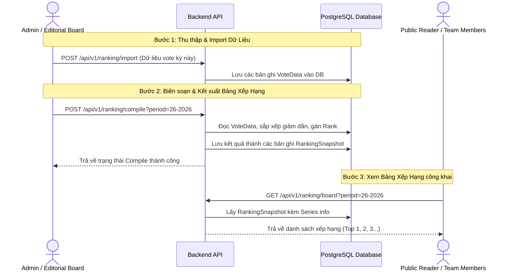
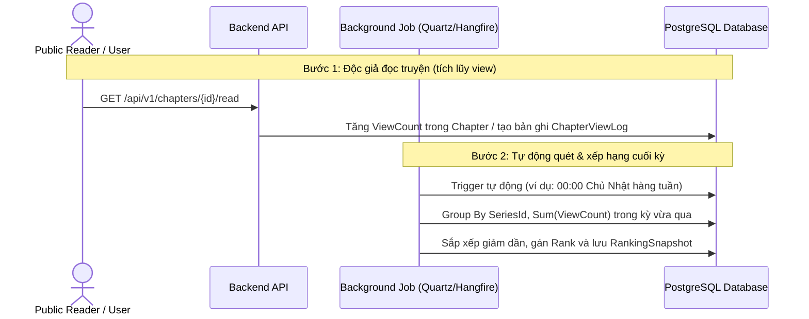

# 📋 Kế hoạch Hoàn thiện Hệ thống — Manga Production Platform
> **Phiên bản:** 2026-06-30 · **Dành cho:** Toàn bộ team (BE + FE)  
> **Quy ước:** 🔨 = cần code mới · ✅ = API đã có, chỉ cần sửa cách gọi · 🔴 = Chặn luồng · 🟡 = Ảnh hưởng UX

---

## Cách đọc tài liệu này

| Ký hiệu | Ý nghĩa |
|---|---|
| **[BE]** | Việc của Backend developer |
| **[FE]** | Việc của Frontend developer |
| **[SHARED]** | Cả hai cùng phối hợp |
| **MF1 / MF2 / MF3** | Mainflow số 1/2/3 |
| **Luồng phụ** | Tính năng dùng chung nhiều luồng hoặc hỗ trợ hệ thống |

---

## ══════════════════════════════════════
## LUỒNG PHỤ / DÙNG CHUNG — Phải làm TRƯỚC
## ══════════════════════════════════════

### 🔴 [SHARED-1] Hệ thống Thông báo (Notifications)
**Thuộc về:** Luồng phụ/Dùng chung — ảnh hưởng MF1, MF2, MF3  
**Trang FE bị ảnh hưởng:** AdminNotificationsPage, BoardNotificationsPage, EditorNotificationsPage  
**Trạng thái:** ✅ API đã có — FE đang gọi sai

#### ❌ Tại sao FE gọi sai?
Ba trang `AdminNotificationsPage`, `BoardNotificationsPage`, `NotificationsPage` (Editor) đều render `<EmptyBackendState>` với dòng "Notification APIs are not available yet." — **nhận định này SAI**. Backend đã có `NotificationsController` tại `/api/v1/notifications` từ trước. Frontend chưa gọi endpoint này vào các trang trên.

#### Các endpoint đã có sẵn trên Backend:
```
GET  /api/v1/notifications          → Lấy danh sách thông báo của user hiện tại
POST /api/v1/notifications/{id}/read → Đánh dấu 1 thông báo đã đọc
POST /api/v1/notifications/read-all → Đánh dấu tất cả đã đọc
```

#### Bước thực hiện:

**[FE] — Bước 1:** Trong `mangaErpService.ts`, thêm hàm:
```ts
async getNotifications(): Promise<Notification[]> {
  return request<Notification[]>("identity", "/api/v1/notifications");
}
async markNotificationRead(id: string): Promise<void> {
  return request<void>("identity", `/api/v1/notifications/${id}/read`, { method: "POST" });
}
```

**[FE] — Bước 2:** Cập nhật `AdminNotificationsPage.tsx`, `BoardNotificationsPage.tsx`, `editors/NotificationsPage.tsx` — xóa `<EmptyBackendState>`, thay bằng logic gọi `mangaErpApi.getNotifications()` và render danh sách.

**[FE] — Bước 3:** Kết nối SignalR hub tại `/hubs/notifications` để nhận thông báo real-time. Khi có sự kiện `ReceiveNotification`, thêm vào danh sách thông báo tại store.

---

### 🔴 [SHARED-2] Admin Dashboard — Thống kê tổng quan
**Thuộc về:** Luồng phụ/Dùng chung  
**Trang FE bị ảnh hưởng:** `AdminDashboardPage.tsx`  
**Trạng thái:** 🔨 Backend chưa có endpoint

#### ❌ Tại sao FE gọi sai?
`AdminDashboardPage.tsx` hiển thị `<EmptyBackendState description="the backend does not expose admin dashboard APIs yet.">` — lần này nhận định **ĐÚNG**, backend thực sự chưa có endpoint này.

#### Bước thực hiện:

**[BE] — Bước 1:** Tạo Query trong `MangaERP.Identity`:
```
File: Application/Queries/GetAdminDashboard/GetAdminDashboardHandler.cs
```
```csharp
public record GetAdminDashboardQuery : IRequest<AdminDashboardDto>;

public record AdminDashboardDto(
    int TotalUsers,
    int ActiveUsers,
    int PendingActivationUsers,
    int TotalSeries,
    int TotalSubmissions,
    int PendingSubmissions,
    int TotalChapters,
    int PublishedChapters
);
```
Handler tổng hợp dữ liệu từ `IUserRepository`, `ISubmissionRepository`, `ISeriesRepository`.

**[BE] — Bước 2:** Thêm endpoint vào `AdminController.cs`:
```csharp
[HttpGet("dashboard")]
public async Task<IActionResult> GetDashboard(CancellationToken ct)
{
    var result = await _mediator.Send(new GetAdminDashboardQuery(), ct);
    return Ok(result);
}
// Route: GET /api/v1/admin/dashboard
```

**[FE] — Bước 3:** Thêm hàm `getAdminDashboard()` vào `mangaErpService.ts`. Cập nhật `AdminDashboardPage.tsx` để gọi API và hiển thị số liệu.

---

### 🟡 [SHARED-3] Luồng Xếp Hạng Series (Ranking Workflow)
**Thuộc về:** Luồng mới/Dùng chung
**Trang FE bị ảnh hưởng:** `RankingAnalyticsPage.tsx` (Board), `RankingReportsPage.tsx` (Editor), public `/ranking` page
**Trạng thái:** 🔨 Backend chưa có Application layer, Infrastructure (EF mappings) và Presentation (Controller)

---

#### 📐 HAI PHƯƠNG ÁN THIẾT KẾ (Team thảo luận & lựa chọn)

Để xác định bảng xếp hạng các Series, team có hai hướng thiết kế chính tùy thuộc vào mục đích của hệ thống (chỉ làm nền tảng quản trị sản xuất hay mở rộng thành cổng đọc truyện công cộng):

##### 🔀 PHƯƠNG ÁN A: Nhập dữ liệu thủ công & Compile theo kỳ (Manual Import & Compile)
*   **Mô tả:** Ban biên tập (Editorial Board) hoặc Admin tổng hợp phiếu bầu của độc giả từ nguồn bên ngoài (ví dụ: bình chọn qua bưu thiếp, Google Form, hệ thống app đọc truyện ngoài) rồi import thủ công vào hệ thống dưới dạng số phiếu thô cho mỗi tác phẩm.
*   **Luồng dữ liệu:**

*   **Ưu điểm:**
    *   Đơn giản, dễ cài đặt trên cả BE và FE.
    *   Đúng theo nghiệp vụ gốc của các tòa soạn truyền thống (tổng hợp vote từ nhiều nguồn trước khi lên bảng xếp hạng chính thức).
    *   Không yêu cầu hệ thống phải xây dựng giao diện đọc truyện công cộng (Reader) để tính view.
*   **Nhược điểm:**
    *   Admin phải thực hiện import dữ liệu định kỳ mỗi tuần/tháng.

---

##### 🔀 PHƯƠNG ÁN B: Tự động thống kê dựa trên Lượt xem Chapter (Auto-tracking from Chapter Views)
*   **Mô tả:** Hệ thống tự động ghi nhận lượt xem/lượt đọc chapter của độc giả thực tế trên hệ thống. Cuối mỗi kỳ, một Background Job sẽ tự động tính toán tổng số lượt xem của tất cả Chapter thuộc từng Series để xếp hạng.
*   **Luồng dữ liệu:**

*   **Ưu điểm:**
    *   Hoàn toàn tự động, không cần con người can thiệp.
    *   Phản ánh trực tiếp độ phổ biến thực tế của truyện trên ứng dụng.
*   **Nhược điểm:**
    *   Phức tạp: Cần bổ sung tracking views, xử lý chống spam view (rate limit, ghi nhận theo Session hoặc IP), xây dựng background worker (Quartz.NET hoặc Hangfire) chạy ngầm.
    *   Không phù hợp nếu dự án hiện tại chỉ tập trung vào phân hệ quản lý sản xuất (Internal ERP) chứ chưa hoàn thiện phân hệ đọc truyện public.

---

#### 🛠️ CÁC BƯỚC THỰC HIỆN CHI TIẾT (Theo Phương Án A - Import & Compile)

##### 1. [BE] THIẾT KẾ CƠ SỞ DỮ LIỆU & REPOSITORY
**Domain Entities đã có sẵn:**
*   `VoteData` (chứa số phiếu thô của một tác phẩm trong một kỳ): `SeriesId`, `VotePeriod` (ví dụ: `26-2026` cho tuần 26 năm 2026), `VoteCount`, `ImportedBy`.
*   `RankingSnapshot` (bảng xếp hạng chính thức sau khi compile): `SeriesId`, `VotePeriod`, `Rank`, `TotalVotes`.

**Công việc Backend:**
*   **Bước 1.1:** Khai báo Repository Interfaces trong `MangaERP.Ranking.Application.Ports`:
    ```csharp
    public interface IVoteDataRepository
    {
        Task AddRangeAsync(IEnumerable<VoteData> votes, CancellationToken ct);
        Task<IEnumerable<VoteData>> GetByPeriodAsync(string votePeriod, CancellationToken ct);
        Task DeleteByPeriodAsync(string votePeriod, CancellationToken ct); // Để hỗ trợ import đè dữ liệu cũ
    }

    public interface IRankingSnapshotRepository
    {
        Task AddRangeAsync(IEnumerable<RankingSnapshot> snapshots, CancellationToken ct);
        Task<IEnumerable<RankingSnapshot>> GetByPeriodAsync(string votePeriod, CancellationToken ct);
        Task<IEnumerable<string>> GetAvailablePeriodsAsync(CancellationToken ct);
    }
    ```
*   **Bước 1.2:** Cấu hình EF Core Mapping cho `VoteData` và `RankingSnapshot` trong `RankingDbContext` (hoặc module infrastructure tương ứng), tạo và chạy migration để cập nhật database PostgreSQL.

---

##### 2. [BE] XÂY DỰNG NGHIỆP VỤ APPLICATION LAYER (MediatR Handlers)
Tạo 3 Handler chính:

*   **Handler 1: `ImportVoteDataCommandHandler`**
    *   *Payload:* `ImportVoteDataCommand(string VotePeriod, List<SeriesVoteInput> Votes)` với `SeriesVoteInput(Guid SeriesId, int VoteCount)`.
    *   *Nghiệp vụ:*
        1. Kiểm tra định dạng `VotePeriod` (ví dụ: `WW-YYYY` hoặc `MM-YYYY`).
        2. Xác thực tất cả `SeriesId` tồn tại trong hệ thống (gọi chéo qua `ISeriesRepository` hoặc dùng read-model).
        3. Xóa dữ liệu vote cũ của kỳ này nếu đã tồn tại (`DeleteByPeriodAsync`).
        4. Lưu danh sách `VoteData` mới vào database.

*   **Handler 2: `CompileRankingCommandHandler`**
    *   *Payload:* `CompileRankingCommand(string VotePeriod)`.
    *   *Nghiệp vụ:*
        1. Lấy danh sách `VoteData` của kỳ chỉ định qua `IVoteDataRepository.GetByPeriodAsync`.
        2. Sắp xếp danh sách giảm dần theo `VoteCount`.
        3. Duyệt danh sách và gán chỉ số `Rank` (từ 1 trở đi). Xử lý trường hợp bằng phiếu (đồng hạng hoặc dùng tiêu chí phụ như ngày tạo series).
        4. Tạo danh sách các thực thể `RankingSnapshot` tương ứng.
        5. Lưu toàn bộ `RankingSnapshot` vào database.

*   **Handler 3: `GetRankingBoardQueryHandler`**
    *   *Payload:* `GetRankingBoardQuery(string? VotePeriod)`.
    *   *Nghiệp vụ:*
        1. Nếu không truyền `VotePeriod`, tự động tìm kỳ mới nhất có snapshot bằng cách truy vấn `GetAvailablePeriodsAsync` rồi lấy kỳ trên cùng.
        2. Truy vấn danh sách `RankingSnapshot` của kỳ đó từ database.
        3. Kết hợp thông tin tên Series, thể loại, ảnh bìa (CoverImageUrl) và tên tác giả từ Series Module.
        4. Trả về danh sách DTO sắp xếp theo thứ tự `Rank` tăng dần.

---

##### 3. [BE] ĐỊNH NGHĨA API CONTROLLER (`RankingController.cs`)
Tạo mới controller định tuyến:

```csharp
[ApiController]
[Route("api/v1/ranking")]
public class RankingController : ControllerBase
{
    private readonly IMediator _mediator;
    public RankingController(IMediator mediator) => _mediator = mediator;

    /// <summary>
    /// Import phiếu bầu thô cho các Series trong một kỳ (dành cho Admin / Editorial Board)
    /// </summary>
    [HttpPost("import")]
    [Authorize(Roles = "Admin,EditorialBoard")]
    public async Task<IActionResult> ImportVotes([FromBody] ImportVoteDataCommand command, CancellationToken ct)
    {
        await _mediator.Send(command, ct);
        return Ok(new { message = "Import raw vote data successfully." });
    }

    /// <summary>
    /// Thực hiện chạy thuật toán xếp hạng và chốt bảng xếp hạng cho kỳ chỉ định
    /// </summary>
    [HttpPost("compile")]
    [Authorize(Roles = "Admin,EditorialBoard")]
    public async Task<IActionResult> CompileRanking([FromBody] CompileRankingCommand command, CancellationToken ct)
    {
        await _mediator.Send(command, ct);
        return Ok(new { message = "Ranking compiled and snapshots saved successfully." });
    }

    /// <summary>
    /// Lấy bảng xếp hạng chính thức của một kỳ (Công khai cho toàn bộ hệ thống & Độc giả)
    /// </summary>
    [HttpGet("board")]
    [AllowAnonymous]
    public async Task<IActionResult> GetRankingBoard([FromQuery] string? period, CancellationToken ct)
    {
        var result = await _mediator.Send(new GetRankingBoardQuery(period), ct);
        return Ok(result);
    }

    /// <summary>
    /// Lấy danh sách các kỳ xếp hạng đã được compile (để đổ vào dropdown select của FE)
    /// </summary>
    [HttpGet("periods")]
    [AllowAnonymous]
    public async Task<IActionResult> GetPeriods(CancellationToken ct)
    {
        var result = await _mediator.Send(new GetAvailablePeriodsQuery(), ct);
        return Ok(result);
    }
}
```

---

##### 4. [FE] TÍCH HỢP TRÊN GIAO DIỆN FRONTEND
Frontend cần implement các phần giao diện tương ứng với các phân quyền:

*   **A. Trang công khai (`/ranking`):**
    *   Thêm Select dropdown hiển thị các kỳ xếp hạng lấy từ `GET /api/v1/ranking/periods`.
    *   Gọi `GET /api/v1/ranking/board?period={selectedPeriod}` để nhận danh sách bảng xếp hạng.
    *   Hiển thị Top 3 tác phẩm nổi bật với huy chương vàng/bạc/đồng lớn, các hạng dưới hiển thị dạng danh sách bảng thường.

*   **B. Trang Quản lý Xếp hạng dành cho Admin / Editorial Board (`RankingAnalyticsPage.tsx`):**
    *   Thêm nút **"Import Vote Data"** mở Modal cho phép Admin nhập dữ liệu:
        *   Chọn kỳ nhập (Period input).
        *   Tải lên file CSV hoặc nhập nhanh danh sách dạng bảng (chọn Series + nhập số phiếu bầu).
        *   Khi submit, gọi `POST /api/v1/ranking/import`.
    *   Thêm nút **"Compile Ranking"** để kích hoạt chạy xếp hạng:
        *   Cho phép chọn kỳ cần compile (mặc định lấy kỳ vừa import).
        *   Gọi `POST /api/v1/ranking/compile` kèm payload. Hiển thị thông báo thành công và tự động reload bảng xếp hạng bên dưới để kiểm tra kết quả ngay lập tức.

---

## ══════════════════════════════════════
## MF1 — Series Submission & Vetting
## ══════════════════════════════════════

> **Mô tả luồng:** Mangaka tạo Submission → Nộp lên EB → EB bỏ phiếu → Phê duyệt/Từ chối/Yêu cầu sửa

### ✅ [MF1-1] Board Dashboard / Voting Center
**Thuộc về:** MF1  
**Trang FE bị ảnh hưởng:** `BoardDashboardPage.tsx`, `VotingCenterPage.tsx`  
**Trạng thái:** ✅ API đã có — FE **chưa implement trang** (không phải gọi sai)

#### ❌ Tình trạng thực tế của FE
Cả hai trang chỉ có **6 dòng code**, toàn bộ nội dung là `<EmptyBackendState>` — **không có useEffect, không có fetch, không có mangaErpApi.xxx() nào được gọi**. FE dev đã để placeholder chờ xác nhận backend có API chưa.

```tsx
// VotingCenterPage.tsx — TOÀN BỘ file chỉ có thế này, không gọi API nào:
export default function VotingCenterPage() {
  return <EmptyBackendState description="The backend does not expose board voting APIs yet." />;
}
```

API backend **đã sẵn sàng**, FE cần implement từ đầu.

#### Endpoint đã có sẵn:
```
GET  /api/v1/submissions/queue           → Hàng đợi duyệt (EB: chưa vote, EIC: conflict + pending, Admin: tất cả)
POST /api/v1/submissions/{id}/cast-vote  → EB/EIC bỏ phiếu (APPROVE / REJECT / REQ_REVISION)
GET  /api/v1/submissions/{id}            → Chi tiết submission kèm thông tin tác giả
POST /api/v1/submissions/{id}/resolve-conflict → EIC phân xử tranh chấp 1-1-1
```

#### Bước thực hiện:

**[FE] — Bước 1:** Thêm vào `mangaErpService.ts`:
```ts
async getSubmissionQueue(): Promise<SubmissionSummaryDto[]>
  → GET /api/v1/submissions/queue  (header Authorization Bearer)

async castVote(submissionId: string, payload: CastVotePayload): Promise<CastVoteResult>
  → POST /api/v1/submissions/{submissionId}/cast-vote
  → payload: { voteType: "APPROVE"|"REJECT"|"REQ_REVISION", comment?, feedbackPins? }
```

**[FE] — Bước 2:** Cập nhật `BoardDashboardPage.tsx` — xóa `EmptyBackendState`, thay bằng bảng danh sách submissions từ `/queue`.

**[FE] — Bước 3:** Cập nhật `VotingCenterPage.tsx` — hiển thị chi tiết 1 submission, form bỏ phiếu với 3 lựa chọn + ô nhập comment + khu vực feedback pin nếu chọn REQ_REVISION.

---

### 🟡 [MF1-2] Cancellation Review Queue
**Trang FE bị ảnh hưởng:** `CancellationReviewPage.tsx` (Board)  
**Trạng thái:** 🔨 Backend thiếu endpoint list submissions đã bị cancel/request-cancel

#### ❌ Tại sao FE gọi sai?
`CancellationReviewPage.tsx` ghi "exposes cancel command but no review queue API yet" — đúng. Backend có `POST /{id}/cancel` nhưng không có endpoint để EB xem queue các yêu cầu hủy đang chờ duyệt.

#### Bước thực hiện:

**[BE] — Bước 1:** Thêm query `GetCancellationQueueQuery` trong Submission module:
```csharp
// Trả về danh sách Series có CancellationStatus == PendingReview
GET /api/v1/series/cancellation-queue  [Authorize(Roles = "EditorialBoard,Admin")]
```

**[FE] — Bước 2:** Cập nhật `CancellationReviewPage.tsx` gọi endpoint trên và hiển thị danh sách + nút Approve/Reject cancellation.

---

## ══════════════════════════════════════
## MF2 — Manga Production (Sản xuất Chapter)
## ══════════════════════════════════════

> **Mô tả luồng:** Mangaka tạo Chapter → Giao trang vẽ cho Assistant → Assistant nộp Layer → Mangaka duyệt → Chuyển QA

### ✅ [MF2-1] Editor Dashboard (Tantou Editor)
**Trang FE bị ảnh hưởng:** `EditorWorkspacePage.tsx`  
**Trạng thái:** ✅ API đã có — FE chưa tích hợp

#### ❌ Tại sao FE gọi sai?
`EditorWorkspacePage.tsx` hiển thị "Editor workspace APIs are not available yet" — **SAI**. Backend đã có đầy đủ:
- `GET /api/v1/series` → Danh sách series mà TE đang phụ trách (filter bằng JWT)
- `GET /api/v1/chapters?seriesId=...` → Danh sách chapter theo series
- `GET /api/v1/qa/{chapterId}/sessions` → Lịch sử QA session của chapter

#### Bước thực hiện:

**[FE] — Bước 1:** Xóa `<EmptyBackendState>` trong `EditorWorkspacePage.tsx`. Gọi `GET /api/v1/series` với JWT của TE — backend tự filter theo `ManagingTantouId` trong JWT.

**[FE] — Bước 2:** Hiển thị danh sách Series mà TE đang quản lý, kèm số chapter đang chờ QA.

**[FE] — Bước 3:** Cập nhật `SeriesMonitoringPage.tsx` (Editor) tương tự — gọi cùng endpoint.

---

### ✅ [MF2-2] Editor Series Monitoring
**Trang FE bị ảnh hưởng:** `SeriesMonitoringPage.tsx` (editors)  
**Trạng thái:** ✅ API đã có — FE chưa tích hợp

#### ❌ Tại sao FE gọi sai?
Trang ghi "Use backend Series pages for real series data" — có nghĩa FE biết API tồn tại nhưng chưa gọi vào trang này.

#### Bước thực hiện:

**[FE] — Bước 1:** Gọi `GET /api/v1/series` (đã có trong `mangaErpService.ts`). Hiển thị dạng bảng với các cột: Tên series, Tác giả, Số chapter, Trạng thái, Chapter mới nhất.

---

### 🔨 [MF2-3] Admin — Series Monitoring
**Trang FE bị ảnh hưởng:** `AdminSeriesMonitoringPage.tsx`  
**Trạng thái:** ✅ API đã có — FE chưa tích hợp + [BE] cần thêm filter `status`

#### Bước thực hiện:

**[BE] — Bước 1:** Đảm bảo `GET /api/v1/series` cho phép Admin xem tất cả series (không filter theo userId). Thêm optional query param `?status=Active|Cancelled|Hiatus`.

**[FE] — Bước 2:** Cập nhật `AdminSeriesMonitoringPage.tsx` — gọi `GET /api/v1/series` với quyền Admin, thêm bộ lọc theo status và filter tìm kiếm theo tên/tác giả.

---

### 🔨 [MF2-4] Admin — Workflow Monitoring
**Trang FE bị ảnh hưởng:** `AdminWorkflowMonitoringPage.tsx`  
**Trạng thái:** 🔨 Backend chưa có endpoint

#### Bước thực hiện:

**[BE] — Bước 1:** Tạo query `GetWorkflowStatsQuery`:
```csharp
// File: MangaERP.Identity/Application/Queries/GetWorkflowStats/GetWorkflowStatsHandler.cs
GET /api/v1/admin/workflow-stats  [Authorize(Roles = "Admin")]

// Response:
{
  pendingSubmissions: 5,       // MF1: đang chờ EB vote
  conflictSubmissions: 1,      // MF1: bị escalate lên EIC
  activeChapters: 12,          // MF2: chapter đang production
  chaptersAwaitingQA: 3,       // MF3: chapter chờ QA
  scheduledPublications: 2     // MF3: đã lên lịch publish
}
```

**[FE] — Bước 2:** Cập nhật `AdminWorkflowMonitoringPage.tsx` hiển thị dashboard workflow với các số liệu trên dưới dạng card + màu trạng thái.

---

## ══════════════════════════════════════
## MF3 — QA & Publishing
## ══════════════════════════════════════

> **Mô tả luồng:** Tantou Editor nhận Chapter → Ghim lỗi (Bug Pins) → Mangaka sửa → TE duyệt → Lên lịch phát hành

### ✅ [MF3-1] Editor — Review Queue (QA)
**Trang FE bị ảnh hưởng:** `ReviewQueuePage.tsx` (editors)  
**Trạng thái:** ✅ API đã có — FE chưa tích hợp

#### ❌ Tại sao FE gọi sai?
Trang render `<EmptyBackendState>` nhưng backend đã có đầy đủ:
- `POST /api/v1/qa/{chapterId}/sessions` → Mở QA session
- `POST /api/v1/qa/{sessionId}/pins` → Ghim lỗi theo tọa độ
- `POST /api/v1/qa/{sessionId}/feedback-batch` → Gửi lô feedback
- `GET  /api/v1/qa/{chapterId}/sessions` → Xem lịch sử QA

#### Bước thực hiện:

**[FE] — Bước 1:** Thêm các hàm QA vào `mangaErpService.ts`:
```ts
openQaSession(chapterId)
addQaPin(sessionId, { pageNumber, x, y, comment, category })
sendFeedbackBatch(sessionId, token)
getQaSessions(chapterId)
```

**[FE] — Bước 2:** Cập nhật `ReviewQueuePage.tsx` — hiển thị danh sách chapters đang chờ QA. Click vào từng chapter mở màn hình QA canvas với khả năng ghim lỗi.

---

### 🔨 [MF3-2] Editor — Publishing Queue
**Trang FE bị ảnh hưởng:** `PublishingQueuePage.tsx` (editors)  
**Trạng thái:** 🔨 Backend cần thêm endpoint filter theo TE role

#### ❌ Tại sao FE gọi sai?
Trang ghi "does not expose an editor publishing queue API yet" — **một phần đúng**. Backend có `GET /api/v1/publishing/chapters` nhưng không có cách filter theo Tantou Editor đang đăng nhập.

#### Bước thực hiện:

**[BE] — Bước 1:** Cập nhật handler `GetPublishingChaptersQuery` để nhận thêm optional param `tantouEditorId`. Nếu caller là TantouEditor, tự động filter theo series mà họ đang phụ trách (`ManagingTantouId`).

```csharp
// Thêm vào PublishingController:
[HttpGet("chapters/my-queue")]
[Authorize(Roles = "TantouEditor")]
public async Task<IActionResult> GetMyPublishingQueue(CancellationToken ct)
{
    var editorId = Guid.Parse(User.FindFirst(ClaimTypes.NameIdentifier)!.Value);
    var result = await _mediator.Send(new GetPublishingQueueByEditorQuery(editorId), ct);
    return Ok(result);
}
// Route: GET /api/v1/publishing/chapters/my-queue
```

**[FE] — Bước 2:** Cập nhật `PublishingQueuePage.tsx` gọi `GET /api/v1/publishing/chapters/my-queue`. Hiển thị danh sách chapters đã được TE approve, kèm nút "Lên lịch phát hành" và nút "Phát hành ngay".

---

## ══════════════════════════════════════
## LUỒNG PHỤ — Admin Identity Management
## ══════════════════════════════════════

### 🟡 [ADMIN-1] Roles & Permissions Page
**Trang FE bị ảnh hưởng:** `AdminRolesPage.tsx`  
**Trạng thái:** 🔨 Backend chưa có endpoint list roles

#### Bước thực hiện:

**[BE] — Bước 1:** Thêm endpoint đơn giản vào `AdminController.cs`:
```csharp
[HttpGet("roles")]
public IActionResult GetRoles()
{
    // Trả về danh sách static roles trong hệ thống
    var roles = new[]
    {
        new { name = "Admin", value = 0, description = "Quản trị viên hệ thống" },
        new { name = "EditorialBoard", value = 1, description = "Ban biên tập" },
        new { name = "EditorInChief", value = 2, description = "Tổng biên tập" },
        new { name = "TantouEditor", value = 3, description = "Biên tập viên phụ trách" },
        new { name = "Mangaka", value = 4, description = "Tác giả truyện tranh" },
        new { name = "Assistant", value = 5, description = "Trợ lý vẽ" },
    };
    return Ok(roles);
}
// Route: GET /api/v1/admin/roles
```

**[FE] — Bước 2:** Cập nhật `AdminRolesPage.tsx` hiển thị bảng roles với mô tả. (Không cần CRUD — roles là static trong hệ thống này.)

---

## ══════════════════════════════════════
## TỔNG HỢP — Bảng phân công công việc
## ══════════════════════════════════════

| ID | Tên task | MF / Luồng | Loại | [BE] | [FE] | Ưu tiên |
|---|---|---|---|---|---|---|
| SHARED-1 | Tích hợp Notifications vào tất cả trang | Dùng chung | ✅ Fix FE | — | Sửa 3 trang | 🔴 Cao |
| SHARED-2 | Admin Dashboard API + trang | Dùng chung | 🔨 Mới | Tạo query + endpoint | Sửa 1 trang | 🔴 Cao |
| SHARED-3 | Ranking Module (BE + FE) | Dùng chung | 🔨 Mới | Repository + Handler + Controller | Sửa ranking page | 🟡 Trung |
| MF1-1 | Board Dashboard + Voting Center | MF1 | ✅ Fix FE | — | Sửa 2 trang | 🔴 Cao |
| MF1-2 | Cancellation Review Queue | MF1 | 🔨 Mới | Query + endpoint | Sửa 1 trang | 🟡 Trung |
| MF2-1 | Editor Dashboard (TE) | MF2 | ✅ Fix FE | — | Sửa 1 trang | 🔴 Cao |
| MF2-2 | Editor Series Monitoring | MF2 | ✅ Fix FE | — | Sửa 1 trang | 🟡 Trung |
| MF2-3 | Admin Series Monitoring | MF2 | ✅ Fix FE | Thêm filter status | Sửa 1 trang | 🟡 Trung |
| MF2-4 | Admin Workflow Monitoring | MF2 | 🔨 Mới | Tạo query + endpoint | Sửa 1 trang | 🟡 Trung |
| MF3-1 | Editor Review Queue (QA) | MF3 | ✅ Fix FE | — | Sửa 1 trang | 🔴 Cao |
| MF3-2 | Editor Publishing Queue | MF3 | 🔨 Mới | Endpoint my-queue | Sửa 1 trang | 🟡 Trung |
| ADMIN-1 | Admin Roles Page | Dùng chung | 🔨 Mới | 1 endpoint static | Sửa 1 trang | 🟢 Thấp |

---

## Lưu ý quan trọng cho cả team

> [!WARNING]
> **Storage, AI Management, Moderation** là các tính năng **nằm ngoài scope** của backend hiện tại. Không cần implement. Các trang này có thể giữ nguyên `EmptyBackendState`.

> [!NOTE]
> **Reports & Analytics** nếu cần thì dùng lại dữ liệu từ Admin Dashboard stats + Ranking board. Không cần endpoint riêng cho phase hiện tại.

> [!IMPORTANT]
> **Thứ tự làm việc đề xuất:**
> 1. SHARED-1 (Notifications) — unblock nhiều trang nhất
> 2. MF1-1 (Board Dashboard + Voting) — core workflow quan trọng nhất
> 3. MF3-1 (QA Review Queue) — cần cho MF3 demo
> 4. MF2-1 (Editor Dashboard) — cần cho TE workflow
> 5. SHARED-2 (Admin Dashboard) — demo cho admin
> 6. Các task còn lại theo priority
