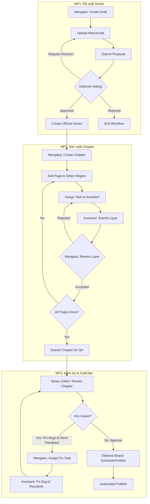

# Tài liệu Đặc tả & Ánh xạ API Hệ thống Quản lý Quy trình Sáng tác và Xuất bản Manga
*(Manga Creation Workflow and Publishing Management System)*

Tài liệu này đặc tả chi tiết 3 luồng quy trình nghiệp vụ cốt lõi (Main Flow) và ánh xạ trực tiếp đến các API Endpoint, phân quyền (Role) và cấu trúc dữ liệu tương ứng trong hệ thống Backend .NET.

---

## 🗺️ Sơ đồ Tổng quan Quy trình (High-Level Workflows)

---

## 📌 MF1 – Series Submission Workflow (Quy trình Đề xuất Series)

### 🎯 Mục tiêu (Purpose)
Cho phép Mangaka gửi đề xuất Series mới để Editorial Board xem xét và quyết định phê duyệt.

### 🔄 Luồng Nghiệp Vụ & Ánh Xạ API Chi Tiết

| Bước | Mô tả nghiệp vụ | API Endpoint & HTTP Method | Phân quyền (Role) | Payload / Thông tin liên quan |
| :--- | :--- | :--- | :--- | :--- |
| **1** | **Mangaka tạo Series Submission** | `POST /api/v1/submissions/draft` | `Mangaka` | `CreateDraftRequest`: `{ title, description, genre, coverImageUrl, manuscriptUrl }` |
| **2** | **Mangaka upload / cập nhật bản thảo** | `PUT /api/v1/submissions/{id}/manuscript` | `Mangaka` | `UpdateManuscriptRequest`: `{ manuscriptUrl }` |
| **3** | **Mangaka cập nhật thông tin nháp** | `PUT /api/v1/submissions/{id}/metadata` | `Mangaka` | `UpdateMetadataRequest`: `{ title, description, genre, coverImageUrl }` |
| **4** | **Mangaka xem lại bản nháp (Draft)** | `GET /api/v1/submissions/{id}` | `Mangaka` | Xem chi tiết thông tin và trạng thái bản nháp. |
| **5** | **Mangaka submit Proposal** | `POST /api/v1/submissions/{id}/submit` | `Mangaka` | Hệ thống tự động khóa bản thảo và chuyển trạng thái sang `Pending_EB_Review`. |
| **6** | **Editorial Board duyệt danh sách chờ** | `GET /api/v1/submissions/queue` | `EditorialBoard` | Lấy danh sách các đề xuất đang chờ phê duyệt. |
| **7** | **Editorial Board đánh giá & bỏ phiếu** | `POST /api/v1/submissions/{id}/vote` | `EditorialBoard` | `CastVoteRequest`: `{ voteType: "APPROVE/REJECT/REQ_REVISION", comment, feedbackPins: [...] }` |

#### 🔄 Nhánh xử lý (Conditional Routes):

*   **IF REVISION REQUIRED (Yêu cầu sửa đổi):**
    *   Trạng thái chuyển thành `Requires_Revision`.
    *   **Mangaka lấy danh sách phản hồi ghim lỗi:** `GET /api/v1/submissions/{id}/feedback-pins` (Quyền: `Mangaka`, `EditorialBoard`).
    *   **Mangaka cập nhật bản thảo sửa đổi:** `PUT /api/v1/submissions/{id}/manuscript`.
    *   **Mangaka nộp lại đề xuất chỉnh sửa:** `POST /api/v1/submissions/{id}/resubmit`. Quy trình quay lại bước đánh giá.
*   **IF APPROVED (Được phê duyệt):**
    *   Sau 3 lượt vote và đạt đa số phiếu thuận, hoặc qua quyết định của Editor-in-Chief tại endpoint: `POST /api/v1/submissions/{id}/resolve-conflict`.
    *   Hệ thống tự động kích hoạt trạng thái phê duyệt, tạo thực thể `MangaSeries` chính thức trong cơ sở dữ liệu và gán Tantou Editor phụ trách.
    *   Hệ thống tự động gửi thông báo cho tác giả qua dịch vụ thông báo real-time.
*   **IF REJECTED (Bị từ chối):**
    *   Trạng thái chuyển thành `Rejected`. Gửi thông báo lý do từ chối cho Mangaka và kết thúc workflow.

---

## 📌 MF2 – Manga Production Workflow (Quy trình Sản xuất Manga)

### 🎯 Mục tiêu (Purpose)
Cho phép Mangaka và Assistant phối hợp sản xuất từng Chapter thông qua cơ chế phân chia công việc (Task) và kiểm duyệt kết quả đóng gói (Artwork Layers).

### 🔄 Luồng Nghiệp Vụ & Ánh Xạ API Chi Tiết

| Bước | Mô tả nghiệp vụ | API Endpoint & HTTP Method | Phân quyền (Role) | Payload / Thông tin liên quan |
| :--- | :--- | :--- | :--- | :--- |
| **1** | **Mangaka tạo Chapter mới** | `POST /api/v1/chapters` | `Mangaka` | `CreateChapterRequest`: `{ seriesId, title, chapterNumber, totalPages, assignedEditorId, coverImageUrl }` |
| **2** | **Mangaka chọn / xem chi tiết Chapter** | `GET /api/v1/chapters/{chapterId}` | `Mangaka`, `TantouEditor` | Lấy chi tiết tiến độ các trang và công việc trong Chapter. |
| **3** | **Mangaka thêm trang truyện cơ sở (Base Page)**| `POST /api/v1/chapters/{chapterId}/pages` | `Mangaka` | `AddBasePageRequest`: `{ pageNumber }` |
| **4** | **Khoanh vùng và phân loại công việc (SAM)** | `POST /api/v1/chapters/{chapterId}/pages/region` | `Mangaka` | `SetPageRegionRequest`: `{ pageNumber, regionMask (JSON polygon), taskType (General/Background/Shading/Inking/Effect/Coloring) }` |
| **5** | **Mangaka phân công Task cho Assistant** | `POST /api/v1/chapters/{chapterId}/pages/activate` | `Mangaka` | `ActivatePageTaskRequest`: `{ pageNumber, assignedAssistantId, description }` |
| **6** | **Assistant nhận danh sách Task được giao** | `GET /api/v1/tasks/assigned?status={status}` | `Assistant` | Bộ lọc trạng thái: `Todo`, `InProgress`, `Submitted`... |
| **7** | **Assistant nộp Layer đã vẽ xong** | `POST /api/v1/tasks/{pageTaskId}/layers` | `Assistant` | `SubmitArtworkLayerRequest`: `{ layerType, fileUrlOriginal, fileUrlOptimized }` |
| **8** | **Mangaka đánh giá chất lượng Layer** | `POST /api/v1/tasks/{pageTaskId}/review` | `Mangaka` | `ReviewLayerRequest`: `{ isAccepted: true/false, rejectionNote }` |

#### 🔄 Nhánh xử lý (Conditional Routes):

*   **IF LAYER NOT ACCEPTED (Từ chối Layer):**
    *   Hệ thống tạo cảnh báo yêu cầu sửa đổi (Revision Alert) và cập nhật trạng thái Task về lại Trợ lý để tiếp tục chỉnh sửa.
    *   Assistant sửa đổi và gọi lại API nộp: `POST /api/v1/tasks/{pageTaskId}/layers`.
*   **IF LAYER ACCEPTED (Chấp nhận Layer):**
    *   Hệ thống ghi nhận trạng thái Layer thành công và tự động tích hợp (merge) Layer đó vào ảnh cơ sở của trang truyện (`Base Page`).
*   **KIỂM TRA HOÀN THÀNH CHAPTER (Chapter Completion Check):**
    *   **Nếu chưa hoàn tất:** Quay lại gán Task và thực hiện cho các trang/phần việc còn thiếu.
    *   **Nếu hoàn tất:** Mangaka gửi chương truyện sang bộ phận đảm bảo chất lượng bằng API:
        *   `POST /api/v1/chapters/{chapterId}/submit-for-qa` (Chuyển trạng thái Chapter sang `Pending_QA`).

---

## 📌 MF3 – QA & Publishing Workflow (Quy trình Đảm bảo Chất lượng & Xuất bản)

### 🎯 Mục tiêu (Purpose)
Đảm bảo chất lượng hình ảnh, nội dung chương truyện đạt quy chuẩn trước khi lưu hành và phát hành tự động theo số báo/lịch trình.

### 🔄 Luồng Nghiệp Vụ & Ánh Xạ API Chi Tiết

| Bước | Mô tả nghiệp vụ | API Endpoint & HTTP Method | Phân quyền (Role) | Payload / Thông tin liên quan |
| :--- | :--- | :--- | :--- | :--- |
| **1** | **Tantou Editor lấy danh sách hoặc chi tiết** | `GET /api/v1/chapters/{chapterId}` | `TantouEditor` | Truy xuất chi tiết toàn bộ các trang vẽ để kiểm tra lỗi. |
| **2** | **Editor ghim đánh dấu lỗi cụ thể** | `POST /api/v1/qa/chapters/{chapterId}/pins` | `TantouEditor` | `AddPinRequest`: `{ pageTaskId, coordinateX, coordinateY, noteMessage, issueType: "Visual/Content", batchToken }` |
| **3** | **Editor hoàn tất đợt ghim lỗi (Feedback Batch)**| `POST /api/v1/qa/chapters/{chapterId}/send-feedback` | `TantouEditor` | `SendFeedbackRequest`: `{ batchToken }`. Hệ thống chuyển trạng thái chapter sang `Rejected`. |
| **4** | **Mangaka lấy danh sách điểm lỗi để xử lý** | `GET /api/v1/qa/chapters/{chapterId}/pins` | `TantouEditor`, `Mangaka` | Trả về danh sách tọa độ và chi tiết các vị trí lỗi cần sửa. |
| **5** | **Mangaka giao việc sửa lỗi & Assistant sửa** | Phối hợp qua luồng sản xuất MF2 | `Mangaka`, `Assistant` | Assistant sửa lỗi tại các trang chỉ định và Mangaka duyệt lại. |
| **6** | **Mangaka nộp lại Chapter sau khi sửa** | `POST /api/v1/chapters/{chapterId}/submit-for-qa` | `Mangaka` | Nộp lại để Editor tiến hành kiểm duyệt vòng kế tiếp. |
| **7** | **Editor xác nhận lỗi đã sửa (Resolve)** | `POST /api/v1/qa/pins/{pinId}/resolve` | `TantouEditor` | Chuyển trạng thái pin lỗi thành resolved sau khi thẩm định lại. |
| **8** | **Editor phê duyệt Chapter thành công** | `POST /api/v1/qa/chapters/{chapterId}/approve` | `TantouEditor` | Kích hoạt khi không còn lỗi chưa sửa. Đổi trạng thái sang `Approved`. |
| **9** | **Editorial Board lên lịch phát hành** | `POST /api/v1/publishing/schedule` | `EditorialBoard` | `ScheduleRequest`: `{ chapterId, seriesId, issueType: "Weekly/Monthly/Special", scheduledPublishAt }` |
| **10**| **Editorial Board phát hành ngay (nếu cần)** | `POST /api/v1/publishing/publish` | `EditorialBoard`, `Admin` | `PublishRequest`: `{ chapterId }` |
| **11**| **Kiểm tra lịch sử phát hành của Series** | `GET /api/v1/publishing/series/{seriesId}/history` | `All Roles` | Truy xuất toàn bộ lịch sử các chapter đã xuất bản của Series. |

#### 🔄 Nhánh xử lý (Conditional Routes):

*   **IF BUGS NOT FIXED (Vẫn còn lỗi):**
    *   Tantou Editor tiếp tục ghim lỗi mới và gửi Feedback Batch tiếp theo. Trạng thái Chapter tiếp tục giữ ở `Rejected`.
*   **IF ALL BUGS FIXED (Đã sạch lỗi):**
    *   Editor thực hiện phê duyệt qua `Approve Chapter` thành công.
*   **SYSTEM AUTOMATED PUBLISH (Xuất bản tự động):**
    *   Background Job của hệ thống tự động quét các bản ghi được lên lịch phát hành (`SchedulePublishCommand`) khớp với thời gian hiện tại để xuất bản tự động chương truyện lên ứng dụng đọc cho độc giả.

---

> [!NOTE]
> Tất cả các API yêu cầu xác thực người dùng đều đi qua lớp lọc token Bearer JWT để lấy `UserId` và `UserRole` tự động trên Controller, từ đó phân quyền chặt chẽ từng hành động theo đúng tác nhân nghiệp vụ (Mangaka, Assistant, Tantou Editor, Editorial Board, Admin).
