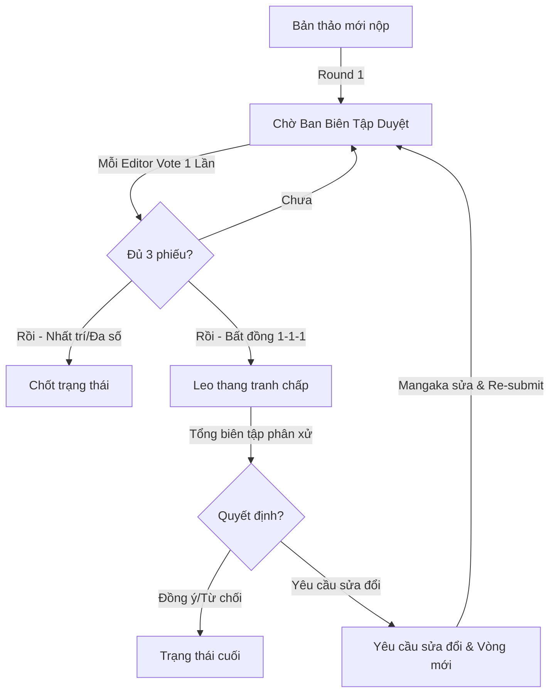
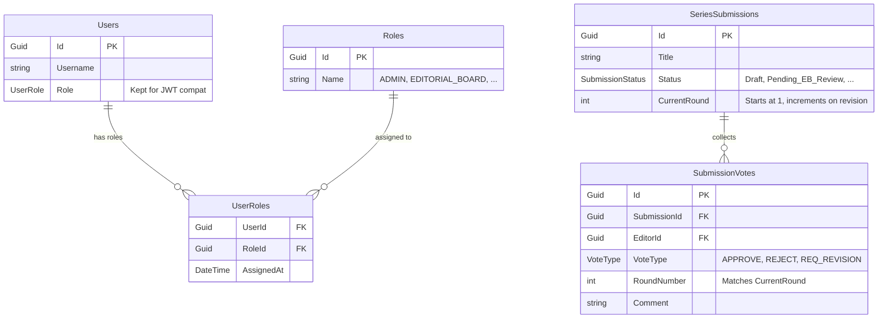

# Báo cáo Cải tiến Hệ thống Quyền (RBAC) & Luồng Duyệt Bản Thảo Tập Thể

Báo cáo này tóm tắt toàn bộ quá trình tái cấu trúc cấu trúc phân quyền (RBAC) và cài đặt cơ chế bỏ phiếu tập thể cho phân hệ quản lý bản thảo (`MangaERP.Submission`), đảm bảo tính nhất quán dữ liệu, chống tranh chấp tài nguyên (race condition) và an toàn khi Admin ghi đè trạng thái.

---

## 1. Tóm tắt Thay đổi (Executive Summary)



### Các hạng mục chính đã triển khai:
1. **RBAC (Role-Based Access Control):** Chuyển đổi từ mô hình Single-Role (lưu trực tiếp enum `Role` trong bảng `User`) sang mô hình quan hệ nhiều-nhiều (Many-to-Many) thông qua hai bảng mới: `Roles` và `UserRoles`.
2. **Collective Voting (Bỏ phiếu tập thể):** Cài đặt bảng `SubmissionVotes` lưu vết các lượt vote theo từng vòng (`CurrentRound`) của các thành viên Ban biên tập (Editorial Board).
3. **Concurrency Control (Chống Race Condition):** Sử dụng khóa hàng bi quan (**Pessimistic Locking - `SELECT FOR UPDATE`**) trong luồng bỏ phiếu để serialize các tác vụ ghi nhận vote và tự động tổng hợp kết quả (Aggregation), tránh việc chạy trùng lặp logic chốt trạng thái.
4. **Admin Override Safety:** Hợp nhất các API cưỡng chế trạng thái của Admin (`/approve`, `/reject`, `/request-revision`) vào các database transaction có cơ chế dọn dẹp các phiếu bầu dang dở của vòng hiện tại.

---

## 2. Thiết kế Cơ sở dữ liệu (Database Schema)

Sơ đồ quan hệ thực thể giữa Identity (RBAC) và Submission (Voting):



### Các Migrations đã tạo:
* **Migration Name:** `AddRbacAndCollectiveVoting`
* **Nhiệm vụ:**
  * Tạo bảng `Roles` và bảng trung gian `UserRoles`.
  * Tạo bảng `SubmissionVotes` lưu trữ các phiếu bầu của vòng duyệt hiện tại.
  * Thêm cột `CurrentRound` vào bảng `SeriesSubmissions` (mặc định là `1`).
  * Khai báo khóa ngoại và các index để tối ưu hiệu năng truy vấn.

---

## 3. Các Giải pháp Kỹ thuật Trọng yếu

### 3.1. Khóa bi quan phòng chống Race Condition (`CastVoteHandler`)
* **Vấn đề:** Khi nhiều Editor bấm vote đồng thời, do cơ chế đọc ghi bất đồng bộ, nhiều luồng có thể cùng đếm được số vote hiện tại dưới 3, dẫn đến logic Aggregation chạy nhiều lần, gây sai lệch trạng thái hoặc lỗi ghi đè dữ liệu.
* **Giải pháp:** 
  1. Trong transaction của luồng vote, lệnh đầu tiên sẽ gọi repository method `GetByIdForUpdateAsync(id)` để tạo khóa hàng:
     ```sql
     SELECT * FROM "SeriesSubmissions" WHERE "Id" = @id FOR UPDATE;
     ```
  2. Các luồng vote đồng thời khác trên cùng một bản thảo sẽ bị block ở tầng PostgreSQL cho đến khi luồng đầu tiên hoàn thành và `Commit` giao dịch.
  3. Các luồng sau khi được giải phóng sẽ thấy trạng thái đã thay đổi (không còn ở trạng thái `Pending_EB_Review` nếu đã chốt) và tự động dừng lại một cách an toàn.

### 3.2. Server-side Queue Filtering (`GetPendingQueueNotVotedByAsync`)
* **Yêu cầu:** Editor chỉ nhìn thấy các bản thảo chưa vote **trong vòng hiện tại** (`CurrentRound`). Khi tác giả sửa đổi và nộp lại (sang vòng mới), các editor đã vote vòng trước phải được phép vote lại.
* **Giải pháp:** Sử dụng truy vấn `NOT EXISTS` hoàn toàn phía database để lọc tối ưu:
  ```sql
  SELECT s.* FROM "SeriesSubmissions" s
  WHERE s."Status" = 'Pending_EB_Review'
    AND NOT EXISTS (
        SELECT 1 FROM "SubmissionVotes" v
        WHERE v."SubmissionId" = s."Id"
          AND v."EditorId" = @EditorId
          AND v."RoundNumber" = s."CurrentRound"
    )
  ORDER BY s."CreatedAt";
  ```

### 3.3. Dọn dẹp Dữ liệu khi Admin Override
* **Vấn đề:** Khi Admin dùng quyền tối cao để Force-Approve, Force-Reject, hoặc Force-Revision trong lúc các Editor đang vote dở dang, database sẽ bị mâu thuẫn nếu giữ nguyên các vote của vòng hiện tại.
* **Giải pháp:** Cả 3 API cưỡng chế của Admin đều được bọc trong một transaction:
  1. Thực hiện kiểm tra trạng thái nghiêm ngặt (chỉ cho phép ghi đè khi bản thảo đang ở trạng thái `Pending_EB_Review` hoặc `Conflict_Escalated`).
  2. Đếm và xóa toàn bộ các phiếu bầu dở dang ở vòng hiện tại (`CurrentRound`) bằng phương thức `DeleteVotesByRoundAsync`.
  3. Chốt trạng thái mới, lưu vết lịch sử và gửi thông báo cho tác giả.

---

## 4. Hướng dẫn Deploy chuẩn bị trên Render

Khi push nhánh `bao` lên và deploy trên Render, vui lòng kiểm tra các mục cấu hình sau trên Render Dashboard để đảm bảo ứng dụng vận hành trơn tru:

1. **Biến môi trường (Environment Variables):**
   * `Seed__AdminPassword`: Mật khẩu cho tài khoản Admin mặc định khi seeding.
   * `ENABLE_SWAGGER`: Đặt thành `true` để kiểm tra các API endpoint mới trên môi trường deploy.
   * `ConnectionStrings__DefaultConnection`: Chuỗi kết nối đến cơ sở dữ liệu PostgreSQL thực tế.
2. **Database Migration:** 
   * Đoạn mã tự động chạy migration đã được kích hoạt trong `Program.cs` thông qua `await db.Database.MigrateAsync();` khi khởi động Web Service.
   * Cấu trúc bảng và dữ liệu vai trò (Admin, Editorial Board, Editor-in-Chief, Tantou Editor, Mangaka) sẽ tự động đồng bộ hóa ngay khi ứng dụng start lần đầu tiên.
